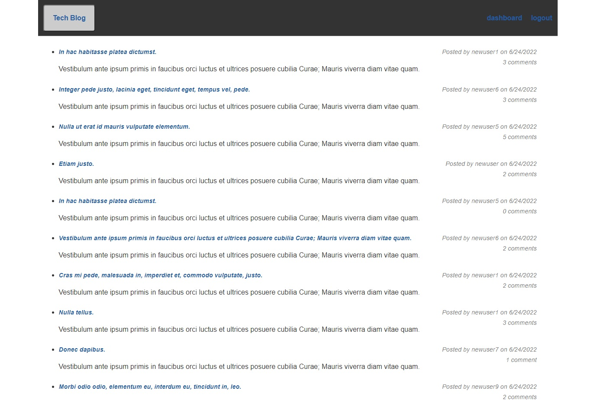

# Tech-Blog

## Description 
This project is an a blog site where developers can publish blog posts and make comments on other bloggers posts. 
The app uses the MVC paradign and built using Node.js, Express.js, Sequelize ORM, Express Session for authentication and Handlebars as a templating engine.

## Table of Contents
* [Usage](#usage)
* [Screenshot](#screenshot)
* [Author](#author)

## Usage 
App can be accessed on [Heroku](https://best-tech-blog.herokuapp.com/) 

## Screenshot

## Author
Ansab Sidiki [Github](https://github.com/asidiki).